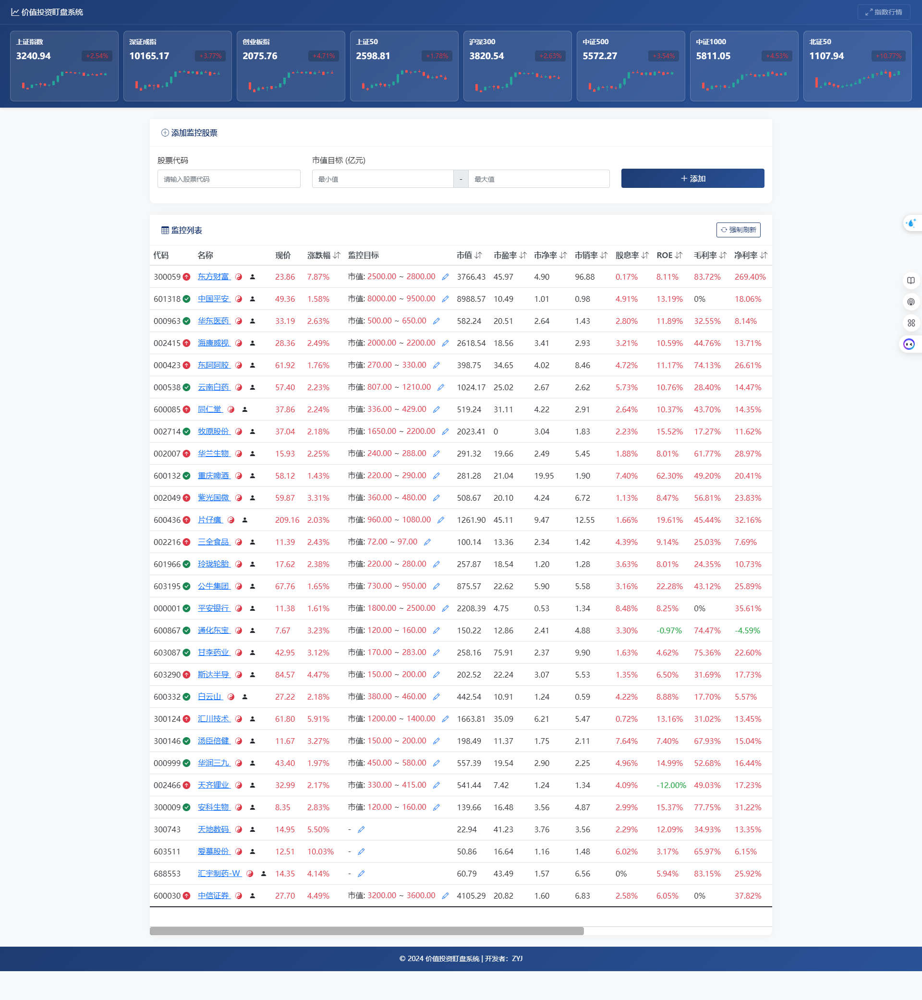

# AI价值投资盯盘系统

一个基于Python的A股智能监控和AI分析系统，集成了多维度的投资分析功能，包括传统价值投资分析、道德经智慧分析以及知名投资大师的视角分析。

## 系统界面预览


## 🚀 核心功能

### 1. 股票监控
- 实时股票数据监控
- 自定义目标市值设置
- 价格和市值预警
- 多维度指标展示（PE、PB、ROE等）

### 2. 指数行情
- 主要指数实时行情展示
- K线图技术分析
- 大盘趋势分析

### 3. AI智能分析
- 基础价值投资分析
  - 财务指标分析
  - 估值分析
  - 风险评估
  - 投资建议
- 道德经分析视角
  - 企业道德评估
  - 可持续发展分析
  - 长期投资价值判断
- 价值投资大咖分析
  - 巴菲特视角
  - 格雷厄姆视角
  - 林园视角
  - 李大霄视角
  - 段永平视角

### 4. 数据管理
- 本地数据缓存
- 历史数据查询
- 分析报告导出
- 自动数据更新

## 🛠️ 技术栈

### 后端
- Python 3.8+
- FastAPI：高性能Web框架
- Tushare：金融数据API
- 豆包大模型：AI分析引擎
- SQLite：本地数据存储

### 前端
- Bootstrap 5：响应式UI框架
- ECharts：数据可视化
- jQuery：DOM操作
- WebSocket：实时数据推送

## 📦 安装部署

### 1. 环境准备
```bash
# 克隆项目
git clone https://gitee.com/your-username/stock-monitor.git
cd stock-monitor

# 创建虚拟环境
python -m venv venv
source venv/bin/activate  # Linux/Mac
venv\\Scripts\\activate  # Windows

# 安装依赖
pip install -r requirements.txt
```

### 2. API配置获取

#### Tushare API
1. 访问 [Tushare官网](https://tushare.pro/)
2. 注册并获取Token
3. 可选：充值获取更高级别权限

#### 豆包大模型API
1. 访问 [豆包大模型控制台](https://ark.cn-beijing.volces.com/)
2. 注册企业账号
3. 创建API Key和Model ID

### 3. 环境配置
1. 复制配置文件
```bash
cp .env.example .env
cp config.template.py config.py
```

2. 修改配置文件
```bash
# 编辑.env文件，填入API密钥
TUSHARE_TOKEN=your_token_here
VOLCES_MODEL_ID=your_model_id_here
VOLCES_API_KEY=your_api_key_here
```

### 4. 启动系统
```bash
python run.py
```
访问 http://localhost:8000 即可使用系统

## 🤝 联系作者

如果您对系统有任何问题或建议，欢迎联系：

- 微信：zyj118
- QQ：693696817
- Email：693696817@qq.com

## 📝 使用说明

### 1. 添加监控股票
1. 在主界面输入股票代码
2. 设置目标市值范围
3. 点击添加即可

### 2. 查看AI分析
1. 点击股票行右侧的分析按钮
2. 选择需要的分析维度（基础/道德经/大咖）
3. 等待AI分析结果

### 3. 指数行情查看
1. 点击顶部导航栏的"指数行情"
2. 查看实时指数数据和K线图

## ⚠️ 注意事项

1. API使用限制
   - Tushare免费账号有调用频率限制
   - 豆包大模型API有Token限制

2. 数据时效性
   - 行情数据实时更新
   - AI分析结果默认缓存1小时

3. 系统性能
   - 建议监控股票数量不超过30只
   - 定时刷新间隔建议60秒以上

## 📄 许可证

MIT License

## 🤝 贡献指南

1. Fork 本仓库
2. 新建 feature_xxx 分支
3. 提交代码
4. 新建 Pull Request

欢迎提交Issue和Pull Request！ 