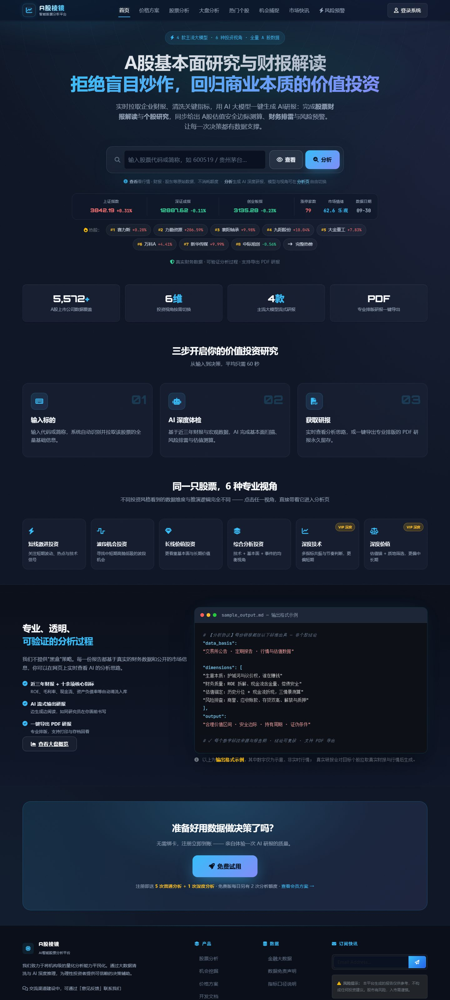
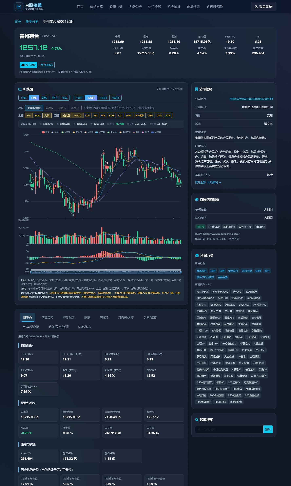
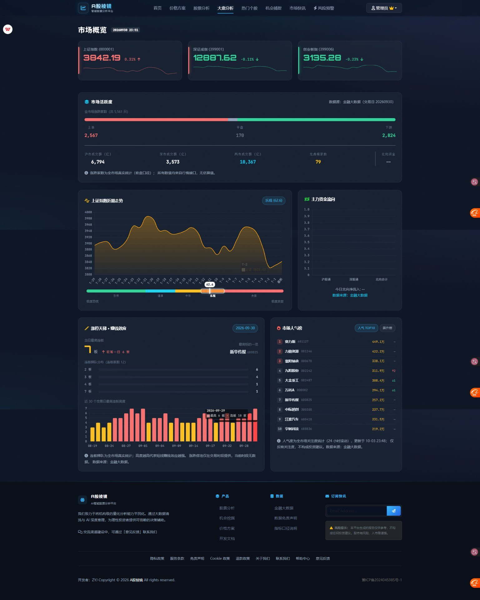
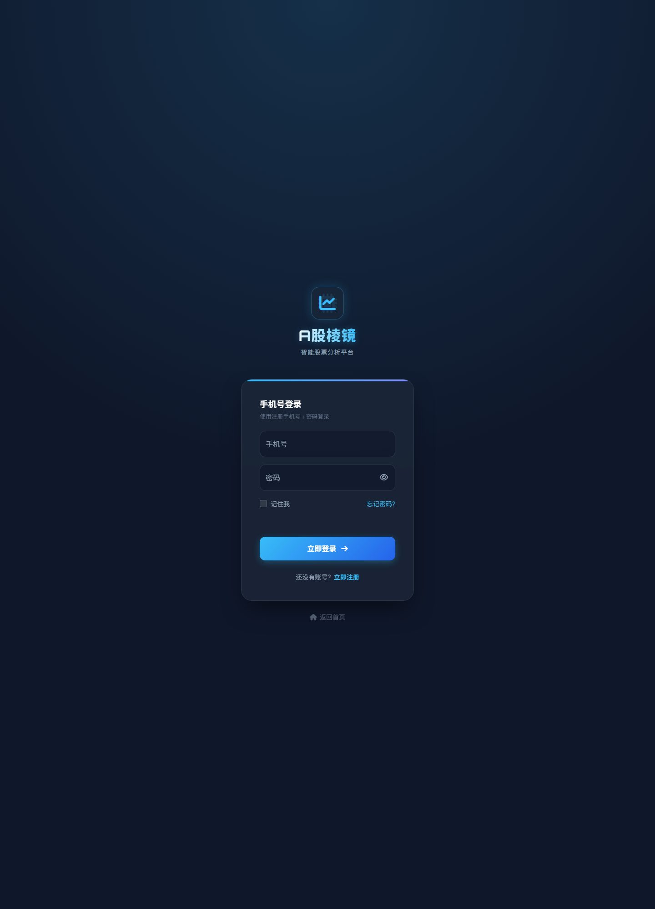

<div align="center">

# A股棱镜 · AI Value Prism



# 拒绝盲目炒作，回归商业本质的价值投资

**把「AI 说的话」变成「可复核的结论」**

[](https://www.python.org/)
[](https://fastapi.tiangolo.com/)
[](https://jinja.palletsprojects.com/)
[](LICENSE)
[](https://gitee.com/zyj118/stock-monitor)
[](https://gitee.com/zyj118/stock-mirror/pulls)

🔗 **在线体验** → <https://stock.a654.com>

</div>

---

## 目录

- [为什么会有这个项目](#为什么会有这个项目)
- [核心差异：让 AI 的结论可以被检验](#核心差异让-ai-的结论可以被检验)
- [功能详解](#功能详解)
- [界面预览](#界面预览)
- [技术栈](#技术栈)
- [快速开始](#快速开始)
- [商业部署与技术支持](#商业部署与技术支持)
- [配置说明](#配置说明)
- [项目结构](#项目结构)
- [文档](#文档)
- [参与贡献](#参与贡献)
- [免责声明](#免责声明)
- [致谢](#致谢)
- [许可证](#许可证)

---

## 为什么会有这个项目

很多人开始炒股的时候，会用到一个叫「AI 选股」的东西。

你输入一只股票，它给你一段看起来很专业的分析，告诉你这只股票值多少钱、该不该买。你觉得挺靠谱，于是照着做。

**然后你发现，它从来没告诉你「对不对」。**

股价真的跌了，它不会说「我之前判断错了」；股价涨了，它会说「你看我说得对吧」。**只输出结论的工具，天然无法被证伪。**

这不是模型能力问题，是产品设计问题 —— 一个不允许自己被检验的系统，本质上是在卖服务，不是在做研究。

**A股棱镜想做的是另一件事。**

---

## 核心差异：让 AI 的结论可以被检验

<div align="center">

**普通 AI 荐股工具**

```
你 → AI 分析 → 结论 → 结束
                  ↓
            股价涨了/跌了，AI 不再说话
```

**A股棱镜**

```
你 → AI 分析 → 结论 + 估值区间 + 评分  → 全部落库
                          ↓
              之后每天自动回填真实表现
              20 / 60 / 120 / 250 个交易日
                          ↓
                  「研报复盘」页面公开对账
                          ↓
        「我上个月说力勤资源合理市值 150~300 亿、结论回避，
          现在市值 200 亿。对错你自己看。」
```

</div>

### 这个闭环能回答三个问题

| 问题 | 怎么回答 |
|---|---|
| **哪些模型更值得信？** | 按模型聚合 20/60 日真实收益与方向命中率，直接排出优劣 |
| **评分高的票真的涨得更好吗？** | 按评分分档（≥7 / 4~7 / <4）统计实际收益，验证评分是否有效 |
| **我的判断整体准不准？** | 全部判断的方向命中率与收益分布，一屏看完 |

**这个数据面板已经内建在系统里了。**

---

## 功能详解

### 一、AI 深度研报

**三档投资偏好**，同一只股票用不同视角分析：

| 偏好 | 适用场景 | 数据侧重 |
|---|---|---|
| **长线价值** | 打算持有 1 年以上 | 多年财务趋势、分红能力、行业地位 |
| **综合分析** | 中等持有期，需要兼顾 | 均衡组合 |
| **深度价值** | 寻找被市场错杀的标的 | 现金流、资产负债、估值分位、安全边际 |

**研报结构（六段固定骨架）**：

```
🏛️ 一、生意本质    —— 这门生意靠什么赚钱，护城河是否真实
🛡️ 二、财务质量    —— ROE 拆解、现金流含金量、偿债安全
📈 三、估值锚定    —— 历史分位 + 现金流折现三情景
🔄 四、周期位置    —— 量价拆解，判断是成长还是周期高点
⚠️ 五、风险排查    —— 商誉、应收账款、存贷双高、解禁与质押
📝 六、决策矩阵    —— 合理价值区间、安全边际、持有周期、证伪条件
```

**核心特性**：

- **每个数字标注来源与报告期**，不做无据推断
- **三情景估值**（悲观 / 中性 / 乐观），给区间而非单点
- **给出证伪条件** —— 什么情况下这个判断算错了
- **PDF 导出**（双引擎：WeasyPrint 主 + xhtml2pdf 兜底）
- **残缺报告拦截** —— 生成中断的半份研报不落库、不扣配额

---

### 二、研报复盘（核心差异化）

**每一个判断都会被事后检验。**

系统自动回填 20 / 60 / 120 / 250 个交易日的真实表现，对比当天的判断：

| 展示维度 | 说明 |
|---|---|
| **模型准确率对比** | 每个模型的样本数、平均评分、20/60 日平均收益、方向命中率 |
| **评分有效性验证** | 高评分档是否真的涨得更好（正相关才说明评分有意义） |
| **判断档案** | 每条判断的股票、分析日、当时评分、结论、估值区间 → 事后真实涨跌 |
| **观察进度** | 尚未到期的新判断显示观察进度条（不是空白页） |

**回填时间表**（每交易日 15:40 自动执行）：

| 窗口 | 到期条件 | 说明 |
|---|---|---|
| 20 交易日 | 分析日 + 45 自然日 | 最早可验证的窗口 |
| 60 交易日 | + 105 自然日 | 中期验证 |
| 120 交易日 | + 195 自然日 | 半年度 |
| 250 交易日 | + 395 自然日 | 完整年度 |

> 为什么用自然日而不是交易日？节假日与停牌无法预估，阈值统一留 15 天余量，宁可晚填也不错填。

---

### 三、合理价告警（不用填阈值）

**这是最贴近实际决策的一个功能。**

传统提醒是「市值跌破 5000 亿」—— 这个数字是你自己随手填的，和你的研究没关系。

A股棱镜的做法是：**阈值自动取自你自己最近一次研报的合理市值下限**。

```
你的研报结论：力勤资源合理市值 150~300 亿（评级：回避）
                    ↓
系统自动设好提醒
                    ↓
市值跌到 150 亿以下 → 触发
「跌进你认定的安全边际了」
```

**八类提醒指标**：

| 指标 | 单位 | 说明 |
|---|---|---|
| **跌破我的研报合理价** | — | **无需填阈值**，自动取研报结论 |
| 总市值 | 亿元 | 适合关注大中小盘切换 |
| 收盘价 | 元 | 常规价格提醒 |
| 涨跌幅 | % | 波动提醒 |
| 市盈率 TTM | 倍 | 估值提醒（亏损股不触发） |
| 市净率 | 倍 | 重资产行业更适用 |
| PB 近五年分位 | % | 「贵不贵」的历史坐标 |
| 财报披露 | 提前天数 | 财报季前的窗口期提醒 |

**关键设计**：
- 若该股**未做过研报**，规则不会触发 —— 宁可不提醒，也不编造阈值
- 取值按 **(用户, 股票)** 维度 —— 同一只票，你和别人的判断不该混为一谈
- 交易时段内每小时评估一次（日线口径，盘中不刷新）

---

### 四、持仓 × 研报联动

**解决「持仓是持仓，研究是研究」两张皮的问题。**

个人中心并排显示：

| 持仓信息 | 研究结论 |
|---|---|
| 持仓成本、数量、盈亏 | 最近研报评分、结论 |
| 分组（核心仓 / 观察仓） | 合理市值区间 |
| 备注 | 分析日期 + 模型 |

**没有研报支撑的持仓会被标出**，并给出「去研报」入口 —— 避免持仓里混了没研究过的票这件事被长期忽略。

顶部还有**研报复盘入口卡**，直接显示你有���少条判断正在跟踪。

---

### 五、数据面板（22 个数据组）

**按投资偏好动态组合**，而不是把所有能拉的数都塞给模型（那只会拖慢速度、浪费 token）。

| 类别 | 数据组 |
|---|---|
| **行情** | 行情速览 |
| **技术面** | 技术指标（MACD/KDJ/RSI/BOLL/CCI/WR/BIAS/ATR/PSY/ROC/DMI/MTM/OBV） |
| **资金** | 资金流向、涨跌停统计、龙虎榜 |
| **估值** | 估值指标（PE/PB/PS/股息率 + 历史百分位） |
| **盈利** | 盈利与杜邦（ROE 拆解 / ROIC / 毛利率） |
| **成长** | 成长与业绩、业绩预告 |
| **财务** | 多年财务、现金流、资产负债 |
| **分红** | 分红与股东回报 |
| **经营** | 商业模式、经营管理 |
| **对比** | 同业对比 |
| **风险** | 风险指标（商誉 / 质押 / 诉讼） |
| **事件** | 公告与事件、热点榜 |

**数据完整度如实展示** —— 每个数据组显示完整度百分比：

```
行情速览    ████████████████ 100%
技术指标    ███████████████░  96%
盈利与杜邦  ██████████████░░  92%
成长与业绩  █████████████░░░  88%
```

> 这一点很重要：数据源限流会导致字段取不到。传统做法是静默跳过，用户看到一份缺项的报告却以为是模型写得不好。**缺数据就该说。**

---

### 六、多源冗余数据架构

**单个数据源故障不会导致整个面板空白。**

| 数据源 | 提供能力 |
|---|---|
| 理杏仁开放平台 | K 线（含复权）、估值指标、历史分位、财务明细、资金流 |
| Tushare 兼容接口 | 日线行情、每日指标、财报、披露计划 |
| 伏尧 iFinD | 龙虎榜、热门榜单、概念热度 |
| AKShare | 免费兜底 |

- 同一指标**优先走主源，失败自动回退备源**
- 供应商下架的接口会被**自动短路**（不浪费配额与时间重试）
- 当日数据未落地时**自动回退到上一交易日**，并如实标注实际数据日期
- 交易日按真实交易日历处理，节假日不误判

---

### 七、市场数据

| 模块 | 内容 |
|---|---|
| **大盘分析** | 三大指数、涨跌家数、成交额、行业轮动、情绪指标 |
| **热门个股** | 人气热榜 + 本站用户分析榜（真实使用热度） |
| **市场快讯** | 实时财经快讯，支持重要性筛选 |
| **机会捕捉** | AI 扫描的潜在机会方向与触发逻辑 |
| **财报披露日历** | 预约披露时间表，提前规划观察窗口 |
| **风险预警** | 业绩暴雷、减持、解禁、监管问询等风险事件 |

---

### 八、会员与配额

- **三通道配额**：每日额度 + 月度体验额度 + 兑换码赠送
- **失败退还**：模型故障或生成中断时**退还对应额度**（用户没得到服务就不该扣次数）
- **兑换码**：支持管理员批量生成
- **防连点**：前端守卫 + 按钮禁用 + 后端 per-user 并发锁（TTL 300 秒 + token 校验）

> 这个功能是踩过坑的：曾有用户 1 分钟内触发 10 次分析、配额被扣 10 次。现在从前端到后端四层防护。

---

## 界面预览

以下均为**线上环境真实截图**。

<details open>
<summary><b>首页</b> · 零输入直达研究</summary>


</details>

<details>
<summary><b>个股研究</b> · 数据面板 + 完整度可见</summary>



</details>

<details>
<summary><b>大盘分析</b> · 全景市场仪表盘</summary>



</details>

<details>
<summary><b>热门个股</b> · 人气与本站分析榜</summary>



</details>

---

## 技术栈

| 层级 | 选型 |
|---|---|
| Web 框架 | FastAPI + Jinja2（服务端渲染，**无前端构建步骤**） |
| 数据库 | MySQL 8（生产）/ SQLite（本地开发回退），DBUtils 连接池 |
| AI 接入 | **OpenAI 兼容协议，任意模型可配** |
| 数据源 | **全部可任意配置**，支持多源冗余 |
| PDF 导出 | WeasyPrint（主）+ xhtml2pdf（兜底）双引擎 |
| 前端 | 原生 JS + Bootstrap 5 + Font Awesome，无打包工具 |
| 设计系统 | CSS 变量令牌（`static/css/tokens.css`）+ 视觉增强层 |

**规模**：60 个 Python 模块 / 26,521 行代码 / 32 个模板 / 68 个路由 / 15 张数据表。

### 强调：模型与数据源都不绑定

系统**不绑定任何一家厂商**，所有渠道都是配置文件里的可选项，后台可视化管理：

- **大模型**：豆包 / DeepSeek / 通义千问 / GLM / Kimi / 本地 Ollama / 任何 OpenAI 兼容端点
- **数据源**：理杏仁 / Tushare 兼容聚合 / 伏尧 iFinD / AKShare

**改配置即可切换，升级模型不用改代码。**

---

## 快速开始

### 方式一：本地开发（SQLite，零配置）

适合先看看它长什么样、走通一遍流程。

```bash
# 1. 克隆
git clone https://gitee.com/zyj118/stock-monitor.git
cd stock-monitor

# 2. 虚拟环境
python -m venv .venv
# Windows
.venv\Scripts\activate
# Linux / macOS
source .venv/bin/activate

# 3. 安装依赖
pip install -r requirements.txt

# 4. 配置环境变量
cp .env.example .env
# Windows: copy .env.example .env
# 生成会话密钥：python -c "import secrets; print(secrets.token_hex(32))"

# 5. 初始化数据库
python migrate_to_mysql.py      # 使用 SQLite 时会自动建库

# 6. 启动
python main.py
# 或：uvicorn main:app --host 0.0.0.0 --port 8015
```

打开 <http://127.0.0.1:8015> 即可。

> **不配置数据源会怎样**：页面框架正常打开，但行情 / 财务面板显示为空 ——
> 这是刻意设计（**没有数据就如实显示为空，不用假数据填充**）。

### 方式二：生产部署（MySQL + Nginx + systemd）

**1. 系统依赖**（PDF 导出需要）：

```bash
sudo apt update
sudo apt install -y python3-venv python3-pip \
  libpango-1.0-0 libpangocairo-1.0-0 libgdk-pixbuf-2.0-0 \
  libffi-dev shared-mime-info fonts-noto-cjk
```

`fonts-noto-cjk` 不装，PDF 里的中文会变方块。

**2. 应用与数据库**：

```bash
sudo useradd -m -s /bin/bash prism
sudo -u prism git clone https://gitee.com/zyj118/stock-monitor.git
cd stock-monitor
sudo -u prism python3 -m venv .venv
sudo -u prism .venv/bin/pip install -r requirements.txt

mysql -u root -p -e "CREATE DATABASE aistock DEFAULT CHARSET utf8mb4;"
mysql -u root -p aistock < schema_mysql.sql
```

**3. 配置**：

```bash
sudo -u prism cp .env.example .env
sudo -u prism nano .env
```

```ini
DB_ENGINE=mysql
MYSQL_HOST=127.0.0.1
MYSQL_PORT=3306
MYSQL_USER=your_user
MYSQL_PASSWORD=your_password
MYSQL_DB=aistock
SESSION_SECRET=<用 openssl rand -hex 32 生成>

# 任意 OpenAI 兼容端点
AI_BASE_URL=https://your-provider.example.com/v1
AI_API_KEY=sk-xxxx
AI_MODEL_ID=your-model
```

**4. systemd 常驻**：

`/etc/systemd/system/prism.service`

```ini
[Unit]
Description=A股棱镜
After=network.target mysql.service

[Service]
Type=simple
User=prism
WorkingDirectory=/home/prism/stock-monitor
Environment="PATH=/home/prism/stock-monitor/.venv/bin"
ExecStart=/home/prism/stock-monitor/.venv/bin/python main.py
Restart=always
RestartSec=5

[Install]
WantedBy=multi-user.target
```

```bash
sudo systemctl daemon-reload
sudo systemctl enable --now prism
sudo systemctl status prism
```

**5. Nginx 反向代理**：

```nginx
server {
    listen 80;
    server_name your.domain.com;

    location / {
        proxy_pass http://127.0.0.1:8015;
        proxy_set_header Host $host;
        proxy_set_header X-Real-IP $remote_addr;
        proxy_set_header X-Forwarded-For $proxy_add_x_forwarded_for;
        proxy_set_header X-Forwarded-Proto $scheme;
    }

    client_max_body_size 20m;
}
```

```bash
sudo ln -sf /etc/nginx/sites-available/your.domain.com /etc/nginx/sites-enabled/
sudo nginx -t && sudo systemctl reload nginx
```

**6. HTTPS**（生产必须）：

```bash
sudo apt install -y certbot python3-certbot-nginx
sudo certbot --nginx -d your.domain.com
```

---

## 商业部署与技术支持

项目提供**付费部署与技术支持服务**，由作者本人交付。

| 服务 | 内容 |
|---|---|
| **私有化部署** | 上线到你的服务器，含环境配置、数据库初始化、HTTPS 证书、备份策略 |
| **数据源接入** | 协助配置你已购买的数据源与 AI 渠道，验证面板取数正常 |
| **定制开发** | 按你的需求调整数据面板、研报结构、告警规则 |
| **技术支持** | 部署后的问题排查与版本升级 |

<p align="center">
  
</p>

<p align="center">
  <b>作者：zyj &nbsp;·&nbsp; 微信：zyj118</b><br>
  <sub>（点击上方二维码可添加微信洽谈，备注「部署」或「定制」）</sub>
</p>

### 限时优惠 · 理杏仁开放平台

如果你的数据源还没着落，推荐用理杏仁（有开源项目专属折扣）：

> **优惠码：`J4XBJK44VTSW`**
> 购买链接：<https://www.lixinger.com/open/api/price-tier?coupon-code=J4XBJK44VTSW>
> **折扣：8 折** &nbsp;·&nbsp; **有效期至 2026-11-02 23:40**

---

## 配置说明

### AI 模型接入

系统使用 OpenAI 兼容协议，**任何服务商都可以**：

```ini
# 云端
AI_BASE_URL=https://ark.cn-beijing.volces.com/api/v3
AI_API_KEY=sk-xxxx
AI_MODEL_ID=ep-xxxx

# 本地 Ollama
AI_BASE_URL=http://127.0.0.1:11434/v1
AI_API_KEY=ollama
AI_MODEL_ID=qwen3:14b
```

模型与渠道的完整管理（温度、最大输出、标签、Logo、是否推荐）都在后台「设置中心」可视化配置，**改配置即可，无需改代码**。

### 数据源配置

全部为可选配置，不填则相关面板显示为空。

| 变量 | 用途 |
|---|---|
| `DATAHUB_BASE_URL` / `DATAHUB_API_KEY` | Tushare 兼容接口（行情、财务、披露计划） |
| `LIXINGER_TOKEN` | 理杏仁开放平台（K 线、估值、股息、财务明细） |
| `FUYAO_TOKEN` | 伏尧 iFinD（龙虎榜、榜单、概念热度） |
| `TUSHARE_TOKEN` | Tushare Pro 官方接口 |
| AKShare | 无需配置，作为免费兜底 |

**多源冗余设计**：同一指标优先走主源，失败自动回退备源。单个数据源故障不会导致整个面板空白。

---

## 项目结构

```
.
├── main.py                  FastAPI 应用入口与路由（68 个路由）
├── ai_service.py            大模型调用、流式输出、思考内容过滤
├── auth.py                  账号、会话、配额、会员等级
├── db.py                    MySQL/SQLite 访问层（15 张表）
├── config.py                配置读取（全部支持环境变量覆盖）
├── settings.py              站点设置（站名、SEO、侧边栏模块）
├── schema_mysql.sql         数据库表结构
├── core/                    横切关注点：安全、护栏、序列化、模板
├── dataservice/             数据层：22 个数据组定义、股票缓存、市场数据
├── routers/                 独立路由模块
├── data_source.py           外部数据源统一入口（含失效接口短路）
├── stock_detail_service.py  个股数据聚合与缓存
├── technical_indicators.py  技术指标计算
├── backfill_valuation.py    研报走势回填（每交易日自动执行）
├── report_postprocess.py    研报后处理（合规标识注入、署名规范化）
├── templates/               Jinja2 模板（32 个）
├── docs/                    文档与配图
└── static/
    ├── css/tokens.css       设计令牌（颜色 / 间距 / 圆角 / 字体）
    ├── css/vision.css       视觉增强层
    ├── css/responsive.css   移动端统一适配层
    └── vendor/              第三方库（已本地化，不依赖 CDN）
```

---

## 文档

| 文档 | 内容 |
|---|---|
| [docs/ARCHITECTURE.md](docs/ARCHITECTURE.md) | 架构设计、数据链路、关键设计决策 |
| [docs/IMPLEMENTATION_NOTES.md](docs/IMPLEMENTATION_NOTES.md) | 实现要点与踩坑记录 |
| [docs/API.md](docs/API.md) | 接口清单与配额规则 |
| [docs/DATA_SOURCES.md](docs/DATA_SOURCES.md) | 数据源能力矩阵与故障降级策略 |

---

## 参与贡献

欢迎提交 Issue 和 PR：

- **Issue**：请附上复现步骤、Python 版本、相关日志（**不要贴 API Key**）
- **PR**：
  1. 从 `main` 切分支：`git checkout -b feat/your-feature`
  2. 保持代码风格一致（现有代码无注释，命名表达意图）
  3. 改动的 `.py` 文件需通过语法校验：`python -m py_compile <file>`

**如果你有部署上的问题**，更建议走[付费技术支持](#商业部署与技术支持)—— 环境问题排查靠 Issues 效率太低。

---

## 常见问题

<details>
<summary><b>必须配置数据源吗？</b></summary>

不配置也能跑，页面框架、账号体系、研报结构都在，但行情与财务面板会显示空。**这是刻意设计 —— 没有数据就如实显示为空，不用假数据填充。**
</details>

<details>
<summary><b>研报复盘什么时候有数据？</b></summary>

需要等分析日满 45 个自然日（20 交易日窗口）才会有第一批收益数据。之后每 20/60/120/250 个交易日自动回填。
**页面会显示观察进度条，不是空白页。**
</details>

<details>
<summary><b>支持哪些大模型？</b></summary>

任何 OpenAI 兼容端点都可以 —— 豆包、DeepSeek、通义千问、GLM、Kimi、以及本地 Ollama。后台可视化配置，无需改代码。
</details>

<details>
<summary><b>PDF 导出中文乱码？</b></summary>

服务器需要安装中文字体：`apt install fonts-noto-cjk`。缺少字体时中文会显示为方块。
</details>

<details>
<summary><b>内存占用大概多少？</b></summary>

应用本身约 190MB（MySQL 另计）。建议**至少 2GB 内存**的服务器 —— 1GB 机器在多数据源并发取数时容易触发 OOM。
</details>

<details>
<summary><b>可以商用吗？</b></summary>

可以，MIT 协议。但请保留版权声明与免责声明 —— 这是对项目的基本尊重。
</details>

---

## 免责声明

本项目为**技术演示与个人研究工具**，不构成任何投资建议。

- 所有分析结论由 AI 模型自动生成，**不保证准确性、完整性或适用性**
- 数据来源于第三方服务，可能存在延迟、缺失或错误
- 依据本项目输出进行的任何投资决策，风险由使用者自行承担
- 请务必独立判断，必要时咨询持牌投资顾问

**市场有风险，投资需谨慎。**

---

## 致谢

- [FastAPI](https://fastapi.tiangolo.com/) / [Jinja2](https://jinja.palletsprojects.com/) —— Web 框架
- [Bootstrap](https://getbootstrap.com/) / [Font Awesome](https://fontawesome.com/) —— UI 基础
- [WeasyPrint](https://weasyprint.org/) —— PDF 渲染
- [AKShare](https://github.com/akfamily/akshare) —— 开源金融数据接口
- [理杏仁](https://www.lixinger.com/) —— 金融数据服务
- 所有在 [Issues](https://gitee.com/zyj118/stock-mirror/issues) 与 PR 中提出建议的贡献者

---

## 许可证

[MIT](LICENSE) © zyj

若你基于本项目二次开发并对外提供服务，请保留本声明与免责声明。

---

<div align="center">

**作者：zyj &nbsp;·&nbsp; 微信 zyj118**

如果这个项目对你有帮助，欢迎点一个 ⭐ Star —— 这对我坚持维护它是最大的鼓励

</div>
