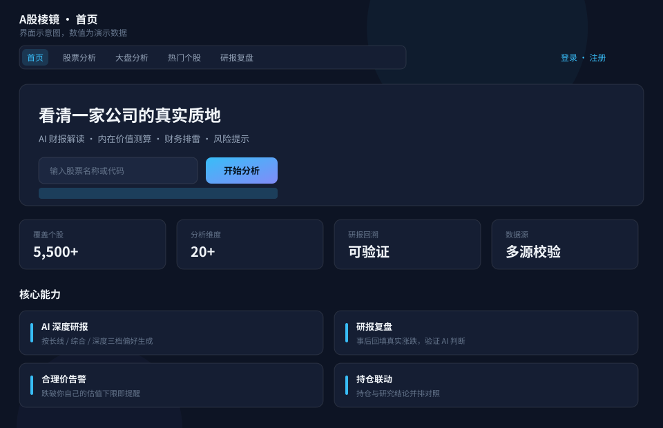
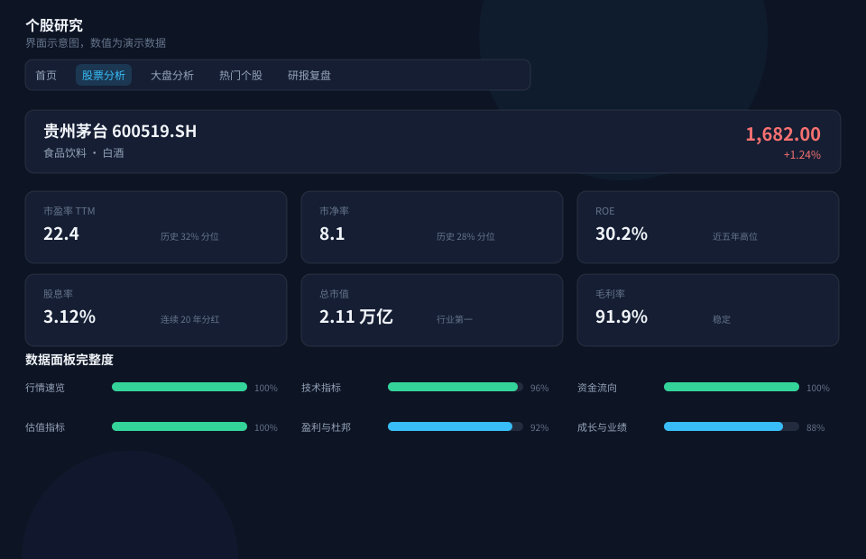
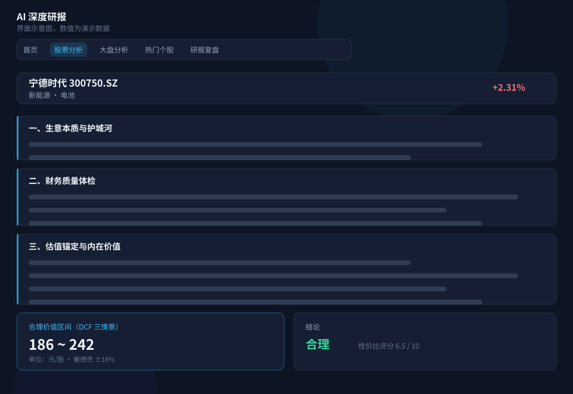
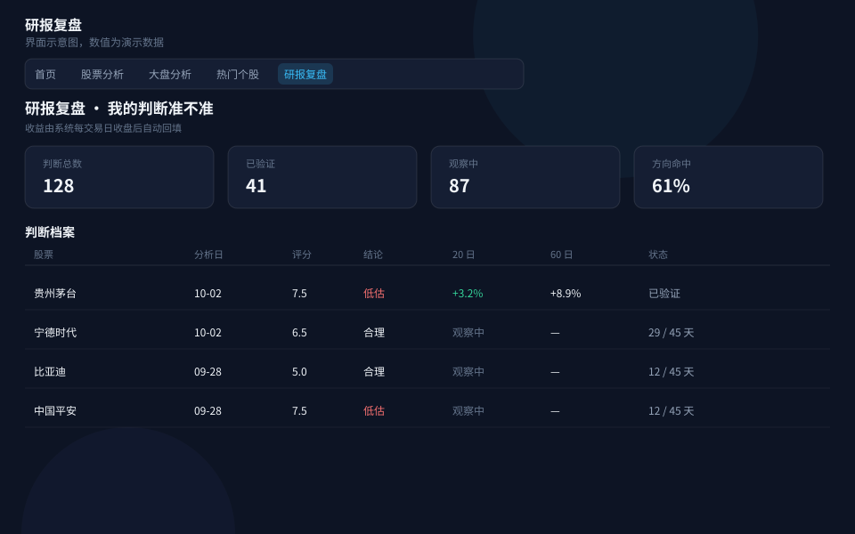
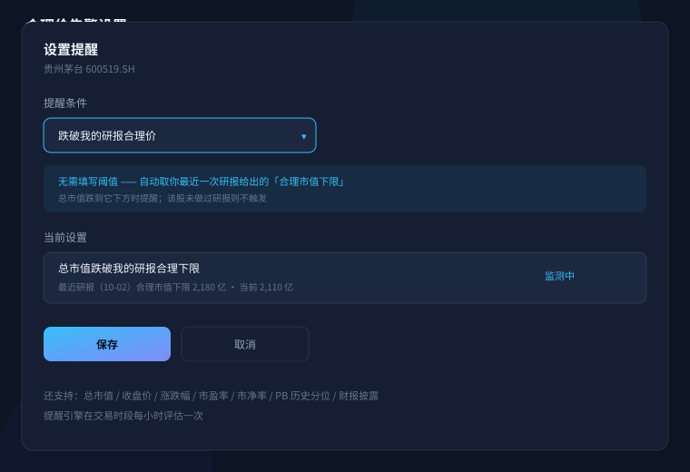

<div align="center">

# A股棱镜 · AI Value Prism

**把「AI 说的话」变成「可复核的结论」**

一个面向个人投资者的 A 股基本面研究平台：用 AI 生成深度研报，再把每一条判断与事后真实涨跌逐条对账。

[](https://www.python.org/)
[](https://fastapi.tiangolo.com/)
[](LICENSE)
[](https://gitee.com/zyj118/stock-monitor)

</div>

---

## 这是什么

市面上的 AI 荐股工具都有一个共同的问题：**只输出结论，不验证结论。**

它们告诉你「这只股票被低估」，然后就没有然后了——股价真的跌了还是涨了，没人会告诉你。久而久之你无法判断这套东西到底准不准，只能继续盲信。

**A股棱镜想做的是另一件事**：每份研报生成的同时，把结论、估值区间、评分全部落库；之后由系统自动回填 20 / 60 / 120 / 250 个交易日的真实表现，并在 `/valuation` 页面公开对账。

> 「我上个月说力勤资源合理市值 150~300 亿、结论回避，现在市值 200 亿。**对错你自己看。**」

---

## 界面

<table>
<tr>
<td width="50%"></td>
<td width="50%"></td>
</tr>
<tr>
<td align="center"><b>首页</b>：零输入直达研究</td>
<td align="center"><b>个股研究</b>：数据面板 + 完整度可见</td>
</tr>
<tr>
<td></td>
<td></td>
</tr>
<tr>
<td align="center"><b>AI 深度研报</b>：三档偏好 · 三情景估值</td>
<td align="center"><b>研报复盘</b>：判断 vs 真实涨跌</td>
</tr>
<tr>
<td colspan="2"></td>
</tr>
<tr>
<td colspan="2" align="center"><b>合理价告警</b>：阈值自动取自你自己的研报结论</td>
</tr>
</table>

> 以上为界面示意图（矢量图，由 [`docs/gen_screens.py`](docs/gen_screens.py) 生成），数值为演示数据，不含任何真实持仓或研报内容。

---

## 核心功能

| 模块 | 说明 |
|---|---|
| **AI 深度研报** | 按「长线价值 / 综合 / 深度价值」三档偏好生成，结构含生意本质、财务质量、估值锚定、周期位置、风险排查、决策矩阵六段；支持 PDF 导出 |
| **三情景估值** | DCF 现金流折现给出悲观 / 中性 / 乐观三档内在价值区间，并标注安全边际 |
| **研报复盘** | 核心差异化功能。自动回填 20/60/120/250 日真实涨跌，公开对账方向命中率与评分有效性 |
| **合理价告警** | 阈值**无需填写**，自动取你最近一次研报的合理市值下限；跌进自己的安全边际即提醒 |
| **持仓 × 研报联动** | 持仓列表并排显示最近研报结论、评分与合理区间，一眼看出「哪些持仓有研究支撑」 |
| **数据面板** | 22 个数据组（行情 / 技术 / 资金 / 估值 / 盈利 / 成长 / 分红 / 股东 / 行业对比…），按投资偏好动态组合 |
| **数据完整度** | 每个数据组的完整度百分比可见。数据缺失时如实展示，不拿旧数据冒充 |
| **自选与提醒** | 自选股分组、持仓成本录入、七类指标告警（总市值 / 收盘价 / 涨跌幅 / PE / PB / PB 历史分位 / 财报披露） |
| **市场数据** | 大盘概览、热门个股、市场快讯、机会捕捉、财报披露日历、风险预警 |

---

## 技术栈

| 层级 | 选型 |
|---|---|
| Web 框架 | FastAPI + Jinja2（服务端渲染，无前端构建步骤） |
| 数据库 | MySQL 8（生产）/ SQLite（本地开发回退），DBUtils 连接池 |
| AI 接入 | OpenAI 兼容客户端，可接任意大模型服务（豆包 / DeepSeek / 通义千问 / GLM / Kimi / 本地 Ollama） |
| 数据源 | 理杏仁开放平台、Tushare 兼容聚合 API、伏尧 iFinD、AKShare |
| PDF 导出 | WeasyPrint（主）+ xhtml2pdf（兜底）双引擎 |
| 前端 | 原生 JS + Bootstrap 5 + Font Awesome，无打包工具 |
| 设计系统 | CSS 变量令牌（`static/css/tokens.css`） |

**规模**：60 个 Python 模块 / 26,521 行代码 / 32 个模板 / 68 个路由 / 15 张数据表。

---

## 快速开始

### 方式一：本地开发（SQLite，零配置）

适合先看看它长什么样、走通一遍流程。

```bash
# 1. 克隆
git clone https://gitee.com/zyj118/stock-monitor.git
cd stock-monitor

# 2. 虚拟环境
python -m venv .venv
# Windows
.venv\Scripts\activate
# Linux / macOS
source .venv/bin/activate

# 3. 安装依赖
pip install -r requirements.txt

# 4. 配置环境变量
cp .env.example .env
# Windows: copy .env.example .env
# 生成会话密钥：python -c "import secrets; print(secrets.token_hex(32))"

# 5. 初始化数据库
python migrate_to_mysql.py      # 使用 SQLite 时会自动建库

# 6. 启动
python main.py
# 或用 uvicorn：
# uvicorn main:app --host 0.0.0.0 --port 8015
```

打开 <http://127.0.0.1:8015> 即可。

> **注意**：不配置数据源的话，页面框架能正常打开，但行情 / 财务面板会是空的 —— 这是刻意的设计（**没有数据就如实显示为空，不用假数据填充**）。

### 方式二：生产部署（MySQL + Nginx + systemd）

以 Ubuntu / Debian + 宝塔或裸机为例。

**1. 系统依赖**（PDF 导出需要）：

```bash
sudo apt update
sudo apt install -y python3-venv python3-pip \
  libpango-1.0-0 libpangocairo-1.0-0 libgdk-pixbuf-2.0-0 \
  libffi-dev shared-mime-info fonts-noto-cjk
```

`fonts-noto-cjk` 不装的话，PDF 里的中文会变成方块。

**2. 应用与数据库**：

```bash
sudo useradd -m -s /bin/bash prism
sudo -u prism git clone https://gitee.com/zyj118/stock-monitor.git
cd stock-monitor
sudo -u prism python3 -m venv .venv
sudo -u prism .venv/bin/pip install -r requirements.txt
```

创建数据库并导入表结构：

```bash
mysql -u root -p -e "CREATE DATABASE aistock DEFAULT CHARSET utf8mb4;"
mysql -u root -p aistock < schema_mysql.sql
```

**3. 配置**：

```bash
sudo -u prism cp .env.example .env
sudo -u prism nano .env
```

```ini
DB_ENGINE=mysql
MYSQL_HOST=127.0.0.1
MYSQL_PORT=3306
MYSQL_USER=your_user
MYSQL_PASSWORD=your_password
MYSQL_DB=aistock
SESSION_SECRET=<用 openssl rand -hex 32 生成>

VOLC_API_KEY=<你的模型 API Key>
VOLC_BASE_URL=https://ark.cn-beijing.volces.com/api/v3
VOLC_MODEL_ID=<模型接入点 ID>
```

**4. systemd 常驻**：

`/etc/systemd/system/prism.service`

```ini
[Unit]
Description=A股棱镜
After=network.target mysql.service

[Service]
Type=simple
User=prism
WorkingDirectory=/home/prism/stock-monitor
Environment="PATH=/home/prism/stock-monitor/.venv/bin"
ExecStart=/home/prism/stock-monitor/.venv/bin/python main.py
Restart=always
RestartSec=5

[Install]
WantedBy=multi-user.target
```

```bash
sudo systemctl daemon-reload
sudo systemctl enable --now prism
sudo systemctl status prism
```

**5. Nginx 反向代理**：

```nginx
server {
    listen 80;
    server_name your.domain.com;

    location / {
        proxy_pass http://127.0.0.1:8015;
        proxy_set_header Host $host;
        proxy_set_header X-Real-IP $remote_addr;
        proxy_set_header X-Forwarded-For $proxy_add_x_forwarded_for;
        proxy_set_header X-Forwarded-Proto $scheme;
    }

    client_max_body_size 20m;
}
```

```bash
sudo ln -sf /etc/nginx/sites-available/your.domain.com /etc/nginx/sites-enabled/
sudo nginx -t && sudo systemctl reload nginx
```

**6. HTTPS**（生产必须）：

```bash
sudo apt install -y certbot python3-certbot-nginx
sudo certbot --nginx -d your.domain.com
```

---

## 数据源配置

全部为可选配置，不填则相关面板显示为空。

| 变量 | 用途 | 申请方式 |
|---|---|---|
| `DATAHUB_BASE_URL` / `DATAHUB_API_KEY` | Tushare 兼容聚合接口（行情、每日指标、估值分位、财报、披露计划） | 第三方聚合服务 |
| `LIXINGER_TOKEN` | 理杏仁开放平台（K 线、估值、股息、财务明细） | lixinger.com 注册 |
| `FUYAO_TOKEN` | 伏尧 iFinD（龙虎榜、榜单、概念热度） | 伏尧开放平台 |
| `TUSHARE_TOKEN` | Tushare Pro 官方接口 | tushare.pro |

**多源冗余设计**：同一指标优先走主源，失败自动回退备源。单个数据源故障不会导致整个面板空白 —— 这也是本项目反复踩坑后固化下来的策略。

### AI 模型接入

系统使用 OpenAI 兼容协议，支持任意服务商，也支持本地模型：

```ini
# 云端（示例）
VOLC_BASE_URL=https://ark.cn-beijing.volces.com/api/v3
VOLC_API_KEY=sk-xxxx
VOLC_MODEL_ID=ep-xxxx

# 本地 Ollama
AI_BASE_URL=http://127.0.0.1:11434/v1
AI_API_KEY=ollama
AI_MODEL_ID=qwen3:14b
```

模型与渠道的完整管理（温度、最大输出、是否featured、标签、Logo）都在后台「设置中心」可视化配置，无需改代码。

---

## 项目结构

```
.
├── main.py                  FastAPI 应用入口与路由（68 个路由）
├── ai_service.py            大模型调用、流式输出、思考内容过滤
├── auth.py                  账号、会话、配额、会员等级
├── db.py                    MySQL/SQLite 访问层（15 张表）
├── config.py                配置读取（全部支持环境变量覆盖）
├── settings.py              站点设置（站名、SEO、侧边栏模块）
├── schema_mysql.sql         数据库表结构
├── core/                    横切关注点
│   ├── security.py          密码哈希、签名、限流
│   ├── guard.py             配置写入护栏
│   ├── serialize.py         DB 行序列化
│   └── templates.py         Jinja2 实例与全局函数
├── dataservice/             数据层
│   ├── common.py            数据组定义、股票列表缓存、交易日判断
│   ├── market.py            大盘、市场脉搏、题材榜
│   └── events.py            公告与事件
├── routers/                 独立路由模块
├── data_source.py           外部数据源统一入口（含失效接口短路）
├── stock_detail_service.py  个股数据聚合与缓存
├── technical_indicators.py  技术指标计算
├── backfill_valuation.py    研报走势回填（每交易日 15:40 自动执行）
├── report_postprocess.py    研报后处理（合规标识注入、署名规范化）
├── templates/               Jinja2 模板（32 个）
└── static/
    ├── css/tokens.css       设计令牌（颜色 / 间距 / 圆角 / 字体）
    ├── css/vision.css       视觉增强层
    ├── css/responsive.css   移动端统一适配层
    └── vendor/              第三方库（已本地化，不依赖 CDN）
```

---

## 文档

| 文档 | 内容 |
|---|---|
| [docs/ARCHITECTURE.md](docs/ARCHITECTURE.md) | 架构设计、数据链路、关键设计决策 |
| [docs/IMPLEMENTATION_NOTES.md](docs/IMPLEMENTATION_NOTES.md) | 实现要点与踩坑记录（源自源码注释） |
| [docs/API.md](docs/API.md) | 接口清单与配额规则 |
| [docs/DATA_SOURCES.md](docs/DATA_SOURCES.md) | 数据源能力矩阵与故障降级策略 |

---

## 已知限制

- **数据源依赖第三方服务**：免费额度与限流策略由各服务商决定，生产部署建议配置至少两个数据源做冗余
- **回填需要时间**：`ret_20d` 等收益字段需等分析日满 45 个自然日才会产生第一批数据，属于设计如此
- **PDF 中文渲染**：依赖系统安装 Noto CJK 字体，容器部署时需显式安装
- **模型输出质量**：不同模型在财务推理上差异明显，建议先用同一只票横向对比几家的结论再决定

---

## 参与贡献

欢迎提交 Issue 和 PR：

- **Issue**：请附上复现步骤、Python 版本、相关日志（**不要贴 API Key**）
- **PR**：
  1. 从 `main` 切分支：`git checkout -b feat/your-feature`
  2. 保持代码风格一致（现有代码无注释，命名表达意图）
  3. 改动的 `.py` 文件需通过语法校验：`python -m py_compile <file>`
  4. 涉及模板改动请同步更新 `docs/` 下相关文档

---

## 免责声明

本项目为**技术演示与个人研究工具**，不构成任何投资建议。

- 所有分析结论由 AI 模型自动生成，**不保证准确性、完整性或适用性**
- 数据来源于第三方服务，可能存在延迟、缺失或错误
- 依据本项目输出进行的任何投资决策，风险由使用者自行承担
- 请务必独立判断，必要时咨询持牌投资顾问

**市场有风险，投资需谨慎。**

---

## 许可证

[MIT](LICENSE) © A股棱镜

若你基于本项目二次开发并对外提供服务，请保留本声明与免责声明。

---

<div align="center">
<sub>如果这个项目对你有帮助，欢迎点一个 ⭐ Star —— 这对我坚持维护它是最大的鼓励</sub>
</div>
